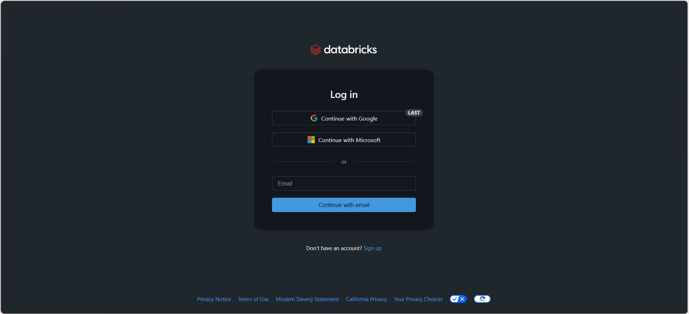
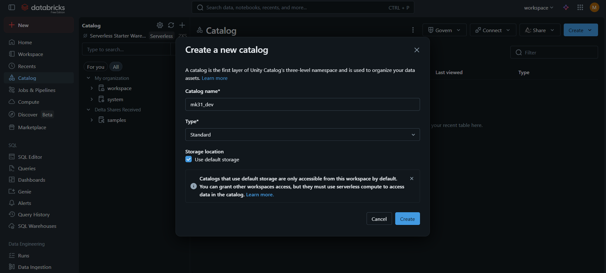
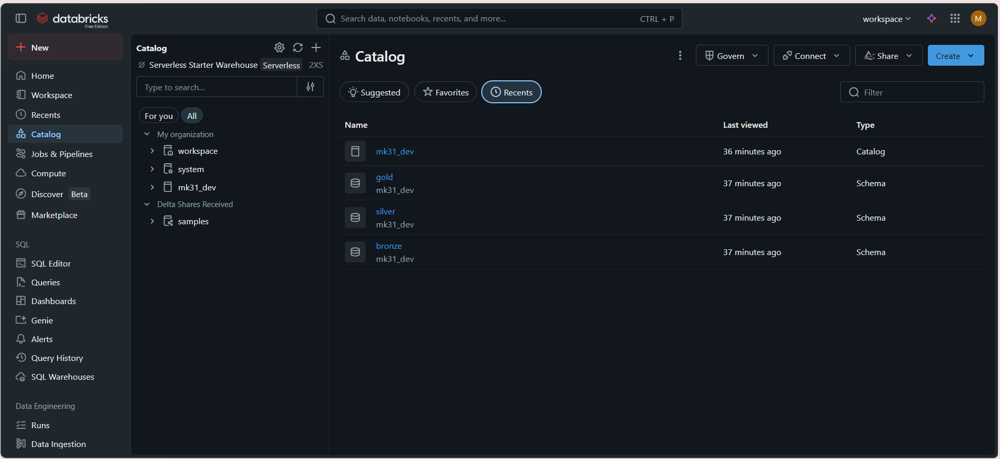
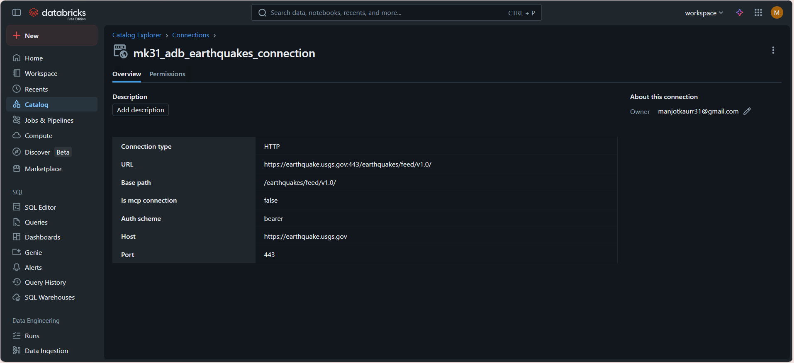
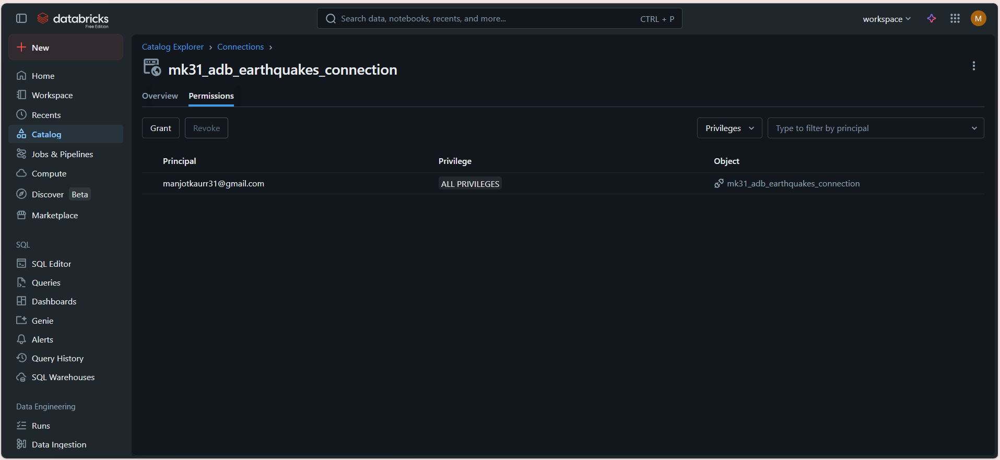
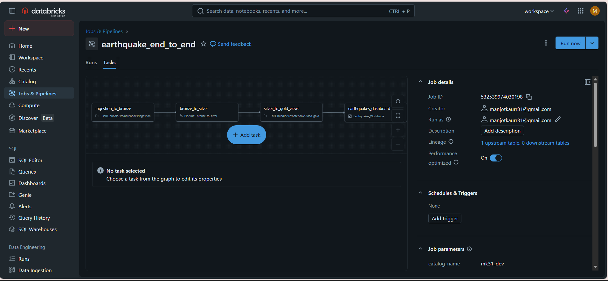
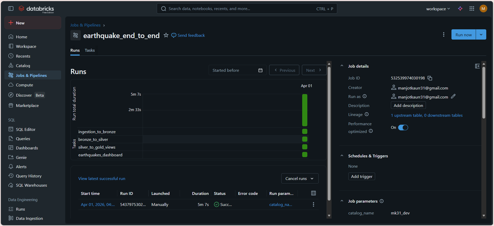
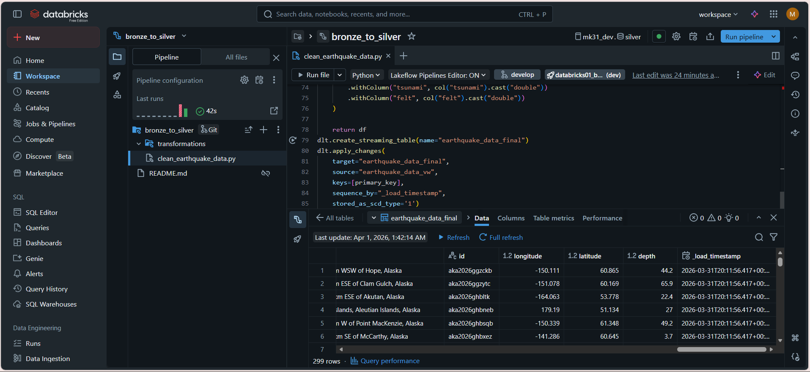
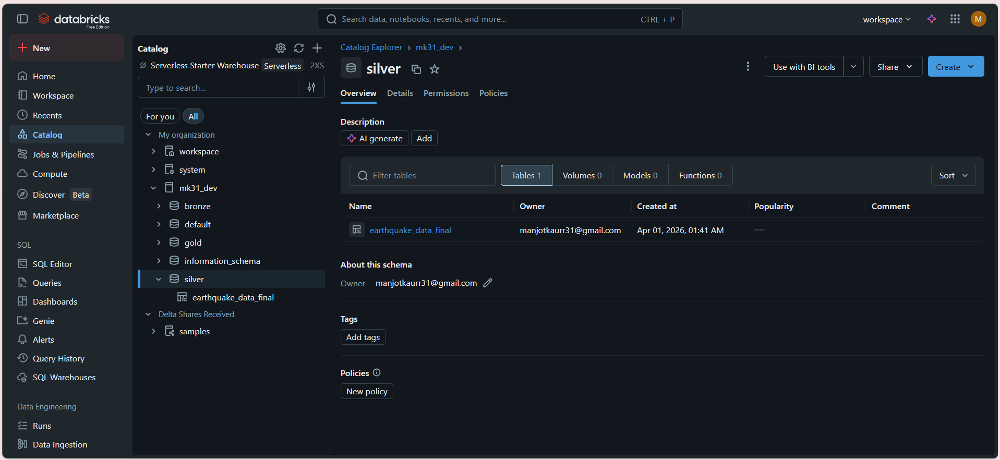
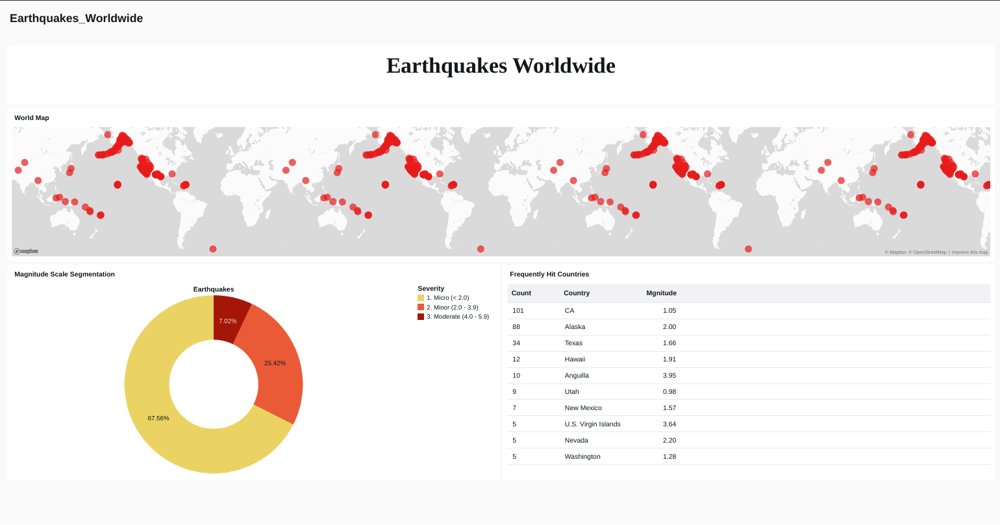

# End-to-End Job Orchestrated Data Pipeline on Databricks

A fully automated, end-to-end data engineering pipeline that ingests real-time earthquake data from the USGS API, processes it through a Medallion Architecture (Bronze → Silver → Gold), and serves it to a live Databricks Dashboard.

**Data Source:** [USGS Earthquake Hazards Program API](https://earthquake.usgs.gov/earthquakes/feed/v1.0/) | **Catalog:** `mk31_dev` | **Job:** `earthquake_end_to_end` | **Dashboard:** `Earthquakes_Worldwide`

---

## Pre-requisites

1. Create a Databricks Free Account.



2. Create a catalog. In this project the catalog used is `mk31_dev`



---

## Architecture

```
USGS Earthquake API (HTTP)
         │
         ▼
┌─────────────────────┐
│   BRONZE LAYER      │  Raw JSON stored in Unity Catalog Volume
│   mk31_dev.bronze   │  Auto Loader picks up new files (cloudFiles)
└─────────────────────┘
         │
         ▼
┌─────────────────────┐
│   SILVER LAYER      │  DLT Pipeline: bronze_to_silver
│   mk31_dev.silver   │  Parsed, flattened, typed, deduplicated
│ earthquake_data_    │  SCD Type 1 via apply_changes()
│      final          │
└─────────────────────┘
         │
         ▼
┌─────────────────────┐
│   GOLD LAYER        │  SQL Notebook: silver_to_gold_views
│   mk31_dev.gold     │  3 analytical views for dashboard consumption
└─────────────────────┘
         │
         ▼
┌─────────────────────┐
│   DASHBOARD         │  Databricks Dashboard: Earthquakes_Worldwide
│  Earthquakes_       │  Pie chart · Point map · Frequency table
│    Worldwide        │
└─────────────────────┘
```

---

## Repository Structure

```
databricks01/
├── src/
│   └── notebooks/
│       ├── ingestion/
│       │   └── ingestion.py          # Task 1: Fetches data from USGS API → Bronze volume
│       │   
│       └── load_gold.py              # Task 3: Creates Gold views from Silver
├── transformations/
│   └── clean_earthquake_data.py      # DLT pipeline logic (Bronze → Silver)
└── README.md
```

---

## External Connection

An HTTP connection to the USGS API is registered in Unity Catalog under Catalog Explorer → External Data → Connections. However, the same can be achieved via .ipynb code.

| Field | Value |
|---|---|
| Connection name | `mk31_adb_earthquakes_connection` |
| Type | HTTP |
| Host | `https://earthquake.usgs.gov` |
| Port | 443 |
| Base path | `/earthquakes/feed/v1.0/` |
| Auth scheme | Bearer |




---

## ⚙️ Job Orchestration

```
Task 1: ingestion_to_bronze
    └──▶ Task 2: bronze_to_silver  (DLT Pipeline)
              └──▶ Task 3: silver_to_gold_views
                        └──▶ Task 4: earthquakes_dashboard
```

Tasks run sequentially — each depends on the success of the previous. `catalog_name` is passed as a job-level parameter; no catalog names are hardcoded anywhere in the code.




---

## 🥉 Bronze Layer

**Task:** `ingestion_to_bronze` | **Notebook:** `src/notebooks/ingestion/ingestion.py`

Calls the USGS Earthquake API and stores raw GeoJSON responses as files in the Unity Catalog Volume at `/Volumes/mk31_dev/bronze/earthquake_data`. No transformations occur here — data is stored exactly as received.

---

## 🥈 Silver Layer

**Task:** `bronze_to_silver` | **Pipeline:** `bronze_to_silver` | **File:** `transformations/clean_earthquake_data.py`
**Output:** `mk31_dev.silver.earthquake_data_final` | **Default schema:** `silver` | **Records:** 299 rows

### Schema Design

Three nested schemas mirror the USGS GeoJSON structure, assembled bottom-up:

```
properties_schema   →   24 fields: mag, place, time, alert, sig, tsunami, felt...
geometry_schema     →   coordinates: ArrayType(DoubleType) → [longitude, latitude, depth]
feature_schema      →   id + properties_schema + geometry_schema
schema              →   ArrayType(feature_schema)  ← API returns a list of events
```

Each schema references the one below it. The final `ArrayType` wrapper is what makes `explode()` necessary in the next step.

### Transformation Steps

```python
# 1. Auto Loader reads raw files as a stream
spark.readStream.format("cloudfiles").option("cloudFiles.format", "json").load(volume_path)

# 2. Parse the raw "features" string column into a structured array
df = df.withColumn("parsed_data", from_json(col("features"), schema))

# 3. Explode array → one row per earthquake event
df = df.select(explode(col("parsed_data")).alias("features"), "_load_timestamp")

# 4. Flatten all nested fields to top-level columns
df = df.select(
    "features.properties.*", "features.id",
    col("features.geometry.coordinates")[0].alias("longitude"),
    col("features.geometry.coordinates")[1].alias("latitude"),
    col("features.geometry.coordinates")[2].alias("depth"),
    "_load_timestamp"
)

# 5. Fix types — USGS timestamps are epoch milliseconds
df = df.withColumn("time", from_unixtime(col("time") / 1000).cast("timestamp"))
       .withColumn("mag", col("mag").cast("double"))  # + nst, sig, tsunami, felt
```

### DLT View vs Table

The transformation logic is wrapped in a `@dlt.view` — an intermediate, non-persisted step — rather than a table. The view feeds directly into `apply_changes()`, which writes to the final persistent table. This avoids storing redundant intermediate data.

### CDC — SCD Type 1

```python
dlt.apply_changes(
    target="earthquake_data_final",
    source="earthquake_data_vw",
    keys=["id"],                        # deduplicate by earthquake ID
    sequence_by="_load_timestamp",      # latest load wins on conflict
    stored_as_scd_type='1'              # overwrites — no history retained
)
```




---

## 🥇 Gold Layer

**Task:** `silver_to_gold_views` | **Notebook:** `src/notebooks/load_gold.py` | **Output schema:** `mk31_dev.gold`

Three views are created dynamically using the `catalog_name` widget — no hardcoded destinations.

### `vw_magnitude_segmentation` — Pie/Donut Chart
Buckets all earthquakes by severity. Columns: `severity_bucket`, `earthquake_count`, `percentage`

| Bucket | Range |
|---|---|
| 1. Micro | mag < 2.0 |
| 2. Minor | 2.0 – 3.9 |
| 3. Moderate | 4.0 – 5.9 |
| 4. Strong | 6.0 – 7.9 |
| 5. Major | 8.0+ |

### `vw_earthquake_map` — Point Map
Provides coordinates and tsunami classification for each event. Columns: `id`, `place`, `latitude`, `longitude`, `depth`, `mag`, `time`, `tsunami_label`, `tsunami`

### `vw_frequent_areas` — Table / Bar Chart
Ranks the top 20 most seismically active regions. Columns: `region`, `earthquake_count`, `avg_magnitude`, `max_magnitude`, `tsunami_count`

---

## Dashboard

**Name:** `Earthquakes_Worldwide` | **Task:** `earthquakes_dashboard` | This dashboard refreshes at every run of the job.

| Visualisation | Dataset | Chart Type |
|---|---|---|
| Magnitude Breakdown | `vw_magnitude_segmentation` | Pie / Donut |
| Earthquake Map | `vw_earthquake_map` | Point Map |
| Frequent Areas | `vw_frequent_areas` | Table |




---

## Branching Strategy

```
develop  ←  active development
main     ←  production
```

All development happens on `develop`. A Pull Request from `develop → main` triggers deployment. The Databricks Job points to the `main` branch in production. Additional files such as yml configurations are necessary to deploy the project after integrating it with appropriate CI/CD pipelines. 

---

## Key Design Decisions

| Decision | Reason |
|---|---|
| No hardcoded catalog names | `catalog_name` passed as a job parameter — promotes cleanly across dev/prod environments |
| `@dlt.view` not `@dlt.table` for intermediate step | Non-persisted — saves storage since only the final CDC table matters |
| SCD Type 1 | Earthquake records update in-place; historical tracking not required |
| SQL notebook for Gold, not DLT | Gold views are reads-only from Silver — a lightweight SQL notebook is simpler and cheaper than a full DLT pipeline |
| Auto Loader (`cloudFiles`) | Incrementally picks up only new files — efficient for continuous ingestion |
| `apply_changes()` with `sequence_by` | Guarantees correct ordering if the same earthquake ID arrives multiple times |

